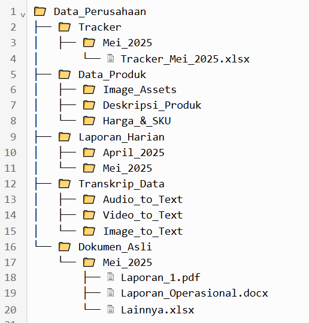
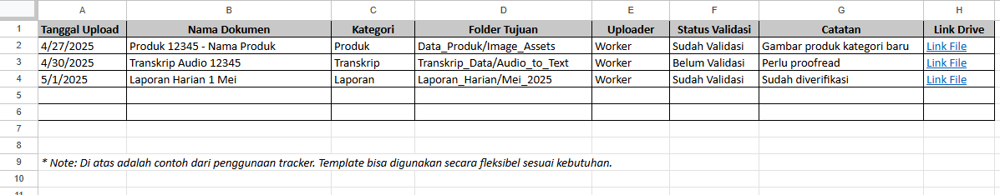

# 📂 Sistem Manajemen & Pelacakan Dokumen

Sistem manajemen dokumen yang dirancang untuk mendukung penyimpanan data secara terstruktur, mendukung kemudahan akses, dan pengarsipan data secara optimal. Dibuat menggunakan Google Drive dan Google Sheets untuk kontrol dokumen berbasis cloud yang mudah diakses dan efisien.

## 🔧 Fitur Utama

- 🗃️ Struktur Folder Tree untuk file produk, laporan harian, transkrip, dll.
- ✅ Google Sheet Tracker untuk memantau status dokumen, riwayat pembaruan, dan log pengecekan.
- 📎 Terintegrasi dengan Google Drive untuk akses file secara real-time.
- 🧠 Cocok untuk alur kerja bisnis dan manajemen data pada penyimpanan lokal atau pada jarak jauh.

## 🖼️ Pratinjau

### 📁 Struktur Folder (Folder Tree)

### 📊 Google Sheet Tracker

## 📁 File yang Disertakan

- `tracker_template.xlsx`: template pelacakan dokumen (bisa diedit)
- `workflow_design.pdf`: dokumentasi opsional alur kerja
- `/screenshots`: gambar pratinjau sistem

## 👨‍💻 Author
Aldiansyah — [LinkedIn](https://linkedin.com/in/...)

## 📜 Lisensi
Lisensi MIT
